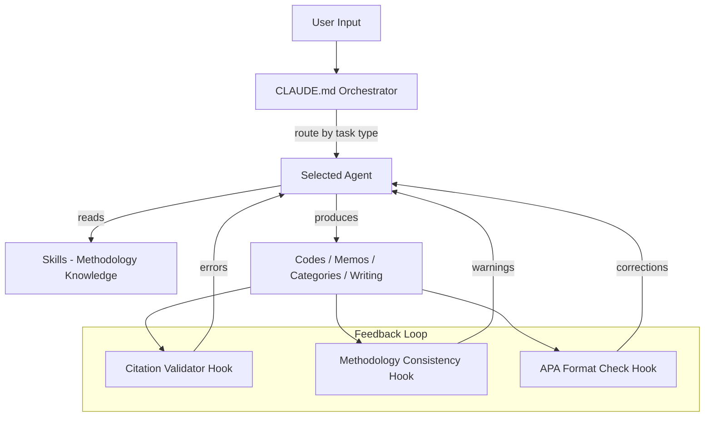

# Architecture

## 1. Overview

Qualitative Research Pro extends Claude Code (and Codex CLI / Cursor) with four component types specialized for academic qualitative research: **agents** execute specialized tasks (grounded theory coding, memoing, academic writing, peer review), **skills** provide deep methodology knowledge (Glaser's coding families, theoretical sampling, saturation assessment), **rules** enforce research standards (ethics, rigor, citation formatting), and **hooks** automate workflow checks (citation validation, methodology consistency). The orchestrator (`CLAUDE.md`) routes tasks to the most specific agent available.

## 2. Component Interaction



The flow works like this:

1. User submits a prompt. The `CLAUDE.md` orchestrator classifies the task and routes to the appropriate specialist agent.
2. The agent reads relevant skills for methodology knowledge (e.g., `glaserian-grounded-theory`, `open-coding`, `memo-writing`).
3. The agent produces analytical output: codes, memos, categories, theoretical models, or academic prose.
4. Hooks fire automatically to check citation formatting, methodological consistency, and writing standards.
5. Errors and warnings feed back into the agent's context for immediate correction.

## 3. Agent System

### Format

30 Markdown files in `agents/`, each with YAML frontmatter:

```yaml
---
name: grounded-theorist
description: Classic Glaser GT methodology expert
model: opus
tools: [Read, Bash, Grep, Glob, Write]
---

# Grounded Theorist

You are the authoritative guide for Glaser's classic grounded theory...
```

**Frontmatter fields:**

| Field | Required | Values |
|-------|----------|--------|
| `name` | Yes | Agent identifier (kebab-case) |
| `description` | Yes | One-line purpose |
| `model` | No | `sonnet` (default) or `opus` (complex reasoning) |
| `tools` | No | Subset of `[Read, Write, Edit, Bash, Grep, Glob, Task]` |

### Agent Squads

| Squad | Agents | Focus |
|-------|--------|-------|
| Methodology Core | 6 | GT methodology, study design, analysis orchestration, comparison, sampling, literature |
| Coding & Analysis | 6 | Open coding, selective coding, theoretical coding, memoing, patterns, categories |
| Quality & Rigor | 5 | Saturation, fit criteria, reflexivity, methodology critique, audit trails |
| Data Work | 4 | Transcripts, field notes, documents, data management |
| Writing & Output | 6 | Findings, methods, discussion, proposals, literature review, citations |
| Cross-Cutting | 3 | Ethics, peer review, planning |

### Analysis Pipeline

Multi-phase analysis orchestrated by `analysis-orchestrator`:

1. **Preparation** — Data organization, transcription review, initial familiarization
2. **Open Coding** — Line-by-line coding with constant comparison
3. **Memoing** — Continuous theoretical memo writing
4. **Selective Coding** — Core category identification and delimiting
5. **Theoretical Coding** — Category integration using coding families
6. **Saturation** — Assessment of theoretical completeness
7. **Sorting** — Memo sorting into theoretical outline
8. **Write-Up** — Substantive theory articulation

## 4. Skill System

### Format

46 `SKILL.md` files across `skills/` subdirectories:

```yaml
---
name: glaserian-grounded-theory
description: Use when conducting classic grounded theory research...
---

# Glaserian Grounded Theory

Methodology procedures, coding techniques, examples...
```

### Skill Categories

| Category | Examples | Count |
|----------|----------|-------|
| GT Core | glaserian-grounded-theory, open-coding, selective-coding, theoretical-coding | 11 |
| Other Methods | thematic-analysis, phenomenological-methods, ethnographic-methods | 8 |
| Data Collection | interview-design, observation-methods, sampling-strategies | 5 |
| Quality & Rigor | qualitative-rigor, member-checking, triangulation | 6 |
| Ethics | research-ethics, vulnerable-populations, data-management-protocols | 3 |
| Academic Writing | academic-writing, apa-formatting, literature-synthesis | 5 |
| Analysis Pipeline | coding-pipeline, category-development, theory-integration, visual-modeling | 4 |
| Research Design | mixed-methods-design, research-questions, conceptual-frameworks, paradigmatic-positioning | 4 |

## 5. Hook System

### Location and Build

- Source: `hooks/src/*.ts`
- Built with esbuild: `npm run build` produces `hooks/dist/*.mjs`
- Tests: `hooks/src/__tests__/` using vitest

### Research-Specific Hooks

| Hook | Trigger | Purpose |
|------|---------|---------|
| `citation-validator` | `.md` file edit | Checks citation formatting against APA 7th / Chicago |
| `methodology-consistency` | `.md` file edit | Warns when GT procedures deviate from Glaser's canon |
| `memo-prompt` | Analysis session | Prompts for memo writing at regular intervals |
| `audit-trail-logger` | Any analysis action | Logs decisions for audit trail |

## 6. Rule System

### Cursor Rules (`.cursor/rules/*.mdc`)

6 Cursor-specific rule files providing IDE-level guidance:

| Rule | Focus |
|------|-------|
| `general.mdc` | Research methodology standards, writing quality, rigor |
| `methodology.mdc` | GT-specific procedures, coding standards |
| `agent-development.mdc` | Agent file format and conventions |
| `skill-development.mdc` | Skill file format and conventions |
| `hook-development.mdc` | Hook file format and build process |
| `testing.mdc` | Testing hooks and validating methodology claims |

### Project Rules (`rules/*.md`)

10 research methodology rule files:

| Rule | Focus |
|------|-------|
| `methodological-rigor.md` | Standards for trustworthy qualitative research |
| `research-ethics-standards.md` | IRB compliance, consent, confidentiality |
| `academic-writing-style.md` | Clear, precise academic prose conventions |
| `gt-coding-standards.md` | Grounded theory coding procedures and conventions |
| `data-handling.md` | Qualitative data security, storage, anonymization |
| `citation-standards.md` | APA 7th, Chicago formatting requirements |
| `reflexivity-requirements.md` | Researcher positionality and reflexive practice |
| `finding-output-format.md` | Structured format for presenting qualitative findings |
| `quality-criteria.md` | Glaser's criteria plus Lincoln & Guba's trustworthiness |
| `current-methodological-state.md` | 2026 state of qualitative methodology and tools |

## 7. Directory Structure

```
qualitative-research-pro/
├── agents/                     # 30 agent definitions (.md with YAML frontmatter)
│   ├── grounded-theorist.md
│   ├── open-coder.md
│   ├── memo-writer.md
│   ├── analysis-orchestrator.md
│   └── ...
│
├── skills/                     # 46 skill directories
│   ├── glaserian-grounded-theory/SKILL.md
│   ├── open-coding/SKILL.md
│   ├── theoretical-coding/SKILL.md
│   ├── memo-writing/SKILL.md
│   └── ...
│
├── hooks/
│   ├── src/                    # TypeScript hook source files
│   │   ├── citation-validator.ts
│   │   ├── methodology-consistency.ts
│   │   └── shared/             # Shared utility modules
│   ├── dist/                   # Built .mjs bundles (esbuild output)
│   ├── package.json
│   └── tsconfig.json
│
├── rules/                      # 10 research methodology rules
│   ├── methodological-rigor.md
│   ├── research-ethics-standards.md
│   ├── gt-coding-standards.md
│   └── ...
│
├── .cursor/rules/              # 6 Cursor IDE rule files (.mdc)
│
├── CLAUDE.md                   # Orchestrator — agent routing, pipeline, rules
├── AGENTS.md                   # Codex CLI instructions
├── README.md                   # Project overview and setup
├── install.sh                  # Claude Code installer
├── package.json                # npm package metadata
├── plugin.json                 # Plugin metadata
└── LICENSE                     # MIT
```

## 8. For Contributors

### Adding an Agent

Create `agents/my-agent.md`:

```yaml
---
name: my-agent
description: What this agent does in one line
model: sonnet
tools: [Read, Grep, Glob, Bash]
---

# My Agent

System prompt goes here. Define the agent's research methodology role,
expertise areas, procedures, and output format.
```

### Adding a Skill

Create `skills/my-skill/SKILL.md`:

```yaml
---
name: my-skill
description: When to use this skill and what methodology knowledge it provides
---

# My Skill

Methodology knowledge — procedures, techniques, examples,
key references, common pitfalls, checklists, templates.
```

### Project Conventions

- Agents are pure Markdown with YAML frontmatter. No executable code.
- Skills are pure Markdown. Methodology knowledge only.
- Rules are pure Markdown. Loaded into every session's context.
- Hooks are TypeScript compiled to ESM bundles.
- All methodology claims must cite primary sources.
- Use Glaser's original terminology when discussing classic GT.
- Distinguish clearly between GT traditions (Glaser, Strauss & Corbin, Charmaz, Clarke).
